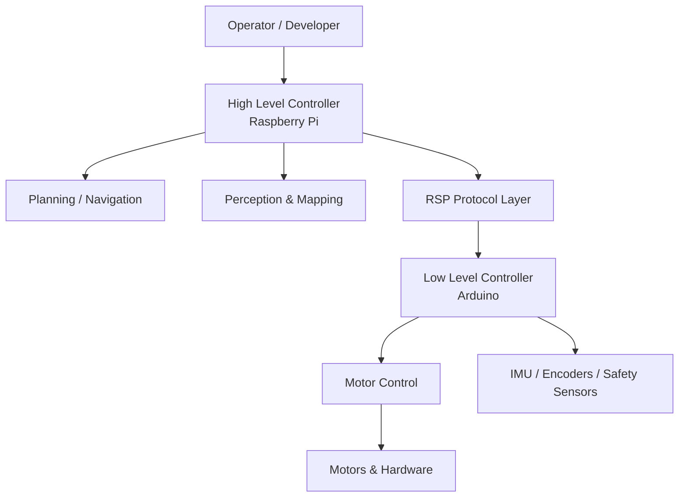
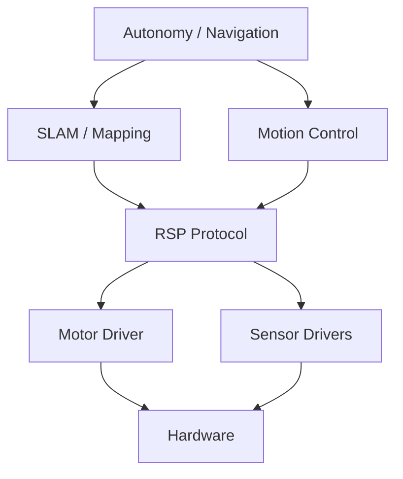
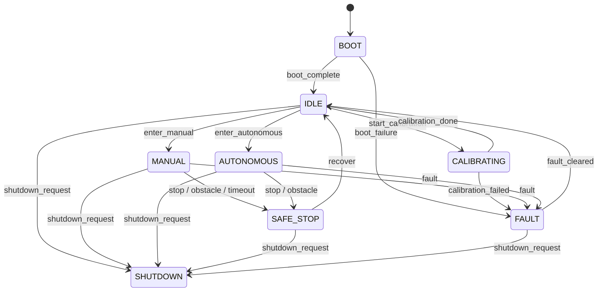
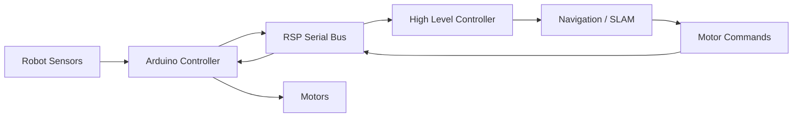
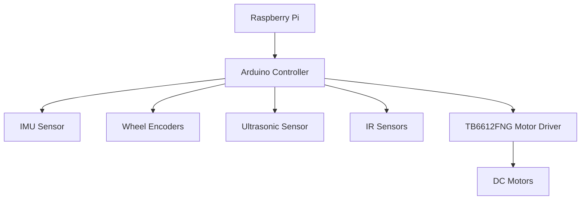

# Robot Architecture Overview

This document provides a high-level overview of the robot architecture, including
hardware layers, software layers, communication protocols, and the robot state machine.

It complements the following specifications:

- **RSP-v1** — Robot Serial Protocol
- **RMSM-v1** — Robot Mode and State Machine Model

The goal is to provide a clear conceptual map of the system.

---

# System Architecture

The robot architecture is organized in layered components.

---

# Software Layer Stack

The robot software can be divided into layers.

---

# Robot State Machine

The robot behavior is governed by the **RMSM-v1 finite state machine**.

---

# Data Flow Overview

Sensors and commands propagate through the system.

---

# Communication Channels

| Channel | Description |
|-------|-------------|
| Serial (RSP) | Primary communication between Raspberry Pi and Arduino |
| Internal MCU | Direct sensor and actuator control |
| Optional Network | Future WiFi / ROS integration |

---

# Hardware Architecture

---

# Design Philosophy

The architecture follows several design principles.

### Separation of Responsibilities

Low-level controller:
- deterministic control
- real-time sensor access
- motor safety

High-level controller:
- perception
- planning
- mapping
- autonomy

---

### Protocol Isolation

The RSP protocol acts as a **stable interface** between:

- low-level firmware
- high-level software

This allows either side to evolve independently.

---

### Safety First

Safety decisions must always override motion commands.

The FSM ensures:

- safe stopping
- deterministic transitions
- clear recovery behavior

---

# Future Extensions

Possible extensions include:

- CAN bus communication
- ROS2 integration
- multi-sensor fusion
- depth camera perception
- distributed robot architecture

---

# Summary

The robot system consists of:

- layered software architecture
- low-level real-time controller
- high-level autonomy controller
- binary serial communication protocol
- finite state machine governing behavior

Together these components provide a robust foundation for building increasingly complex autonomous capabilities.
